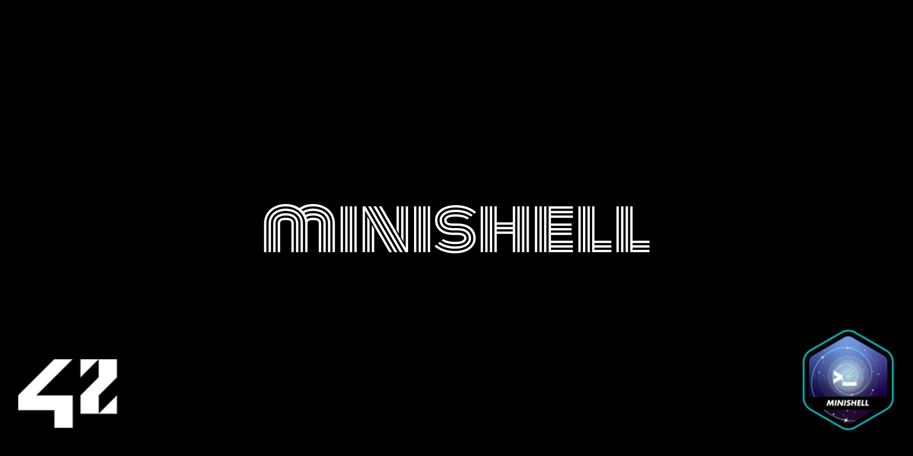

# minishell



Welcome, terminal tinkerers and command-line enthusiasts! I’m thrilled to share our journey through the **minishell** project, one of the most challenging and rewarding experiences at 42 Berlin. This collaborative endeavor goes beyond simple coding—it's about understanding the inner workings of shells, processes, signals, and user interactions. By recreating features reminiscent of a classic bash environment, We’ve gained invaluable insights into system-level programming and team coordination.


---

## About

**minishell** isn’t just another assignment—it’s a deep dive into how command interpreters operate under the hood. Together with a fellow student, I’ve worked on designing and implementing:

- **Command Parsing & Execution:** Handling user input, interpreting quotes and expansions, and executing the right binaries from `$PATH`.
- **Redirections & Pipes:** Using `<`, `>`, `<<`, `>>`, and `|` to reroute input/output streams, link multiple commands, and simulate pipelines.
- **Built-In Commands:** Reimplementing essential shell commands like `echo`, `cd`, `pwd`, `export`, `unset`, `env`, and `exit`.
- **Signal Handling & Terminal Behavior:** Managing signals (`ctrl-C`, `ctrl-D`, `ctrl-\`) gracefully, ensuring that the shell responds just like a standard bash shell in interactive mode.
- **Environment Variable Expansion:** Expanding `$VAR` and `$?` to reflect the current environment and the exit status of the last command.

Throughout this project, We’ve confronted many intricate challenges:
- Mastering the use of `fork`, `execve`, `pipe`, and other low-level functions.
- Synchronizing processes and avoiding race conditions.
- Ensuring no unclosed quotes break the logic and that special characters are handled correctly.
- Managing a reliable command history and handling edge cases like `ctrl-D` (end of input) gracefully.
- Adhering to strict code norms and practices while developing a robust, maintainable codebase.

This project was tested and developed on **Linux** systems, guaranteeing a stable and portable environment.

---

## Project Highlights

- **Program Name:** `minishell`
- **Files Submitted:** Makefile, *.h, *.c
- **Makefile Rules:** `NAME`, `all`, `clean`, `fclean`, `re`
- **Authorized External Functions:**  
  `readline`, `rl_clear_history`, `rl_on_new_line`, `rl_replace_line`, `rl_redisplay`, `add_history`,  
  `printf`, `malloc`, `free`, `write`, `access`, `open`, `read`, `close`, `fork`, `wait`, `waitpid`, `wait3`, `wait4`, `signal`, `sigaction`, `sigemptyset`, `sigaddset`, `kill`, `exit`, `getcwd`, `chdir`, `stat`, `lstat`, `fstat`, `unlink`, `execve`, `dup`, `dup2`, `pipe`, `opendir`, `readdir`, `closedir`, `strerror`, `perror`, `isatty`, `ttyname`, `ttyslot`, `ioctl`, `getenv`, `tcsetattr`, `tcgetattr`, `tgetent`, `tgetflag`, `tgetnum`, `tgetstr`, `tgoto`, `tputs`
- **Libft:** Authorized
- **Description:** Write a functional shell with interactive mode, builtins, pipes, redirections, and signal handling.

---

## Core Mechanics

**minishell** recreates a subset of bash features, focusing on correctness and robustness:

1. **Prompt & History:** Displays a prompt and keeps track of command history via `readline`.
2. **Parsing & Quoting:** Handles single and double quotes, preventing unwanted interpretation of metacharacters.
3. **Redirections & Pipes:** Redirects input and output, and supports multiple commands chained with pipes.
4. **Variable Expansion:** Expands environment variables and `$?` to reflect the last command’s exit status.
5. **Builtins Implemented:**
   - `echo` (with `-n` option)
   - `cd` (with relative or absolute paths)
   - `pwd`
   - `export`
   - `unset`
   - `env`
   - `exit`
6. **Signals & Special Keys:**
   - `ctrl-C` starts a new prompt on a new line (in interactive mode).
   - `ctrl-D` exits the shell.
   - `ctrl-\` does nothing (in interactive mode).
   
**No extraneous globals:** We avoided using global variables, except for a single global variable to indicate a received signal number—ensuring a clean and maintainable design.


---

## Challenges & Learnings

This project elevated our understanding of:
- **System Programming:** Diving deep into POSIX functions and process creation.
- **Memory Management & Error Handling:** Ensuring every allocation is checked and properly freed.
- **Synchronization & Signals:** Managing asynchronous events without data races or inconsistent states.
- **Code Structuring & Teamwork:** Collaborating effectively, maintaining a clear architecture, and documenting code for mutual understanding.

**minishell** taught us to approach problems methodically, test frequently, and anticipate edge cases. The result is a robust, minimalistic shell that simulates a mini-bash environment and solidifies a foundation for future system-level projects.

---

## Getting Started

1. **Clone the Repository:**
   ```bash
   git clone https://github.com/korberlin/minishell.git
   cd minishell
   ```

2. **Build the Project:**
   ```bash
   make
   ```
   After compilation, you’ll have the `minishell` executable ready.

3. **Run Minishell:**
   ```bash
   ./minishell
   ```
   Start typing commands and enjoy your custom shell experience!

---

## Contributing

Got ideas to enhance minishell, spot bugs, or improve efficiency? Contributions are always welcome! Open an issue or submit a pull request to help this project evolve further.

---


**Thank you for exploring my minishell project!**  
May this journey into the heart of the command line inspire you to dig deeper into operating systems, shell internals, and the art of writing clean, reliable, and efficient C code. Happy hacking! 🎉
